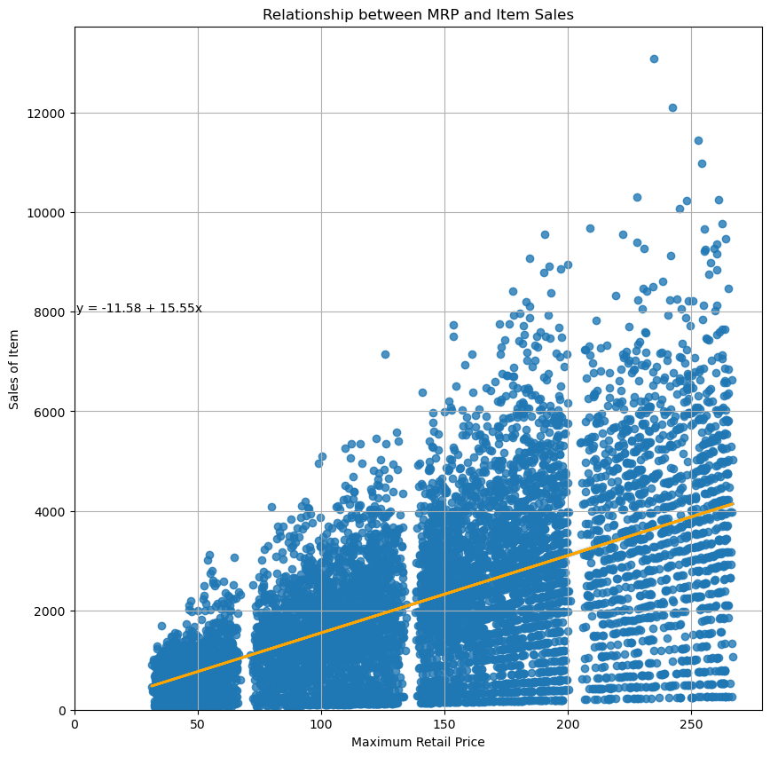

# Food Sales Predictions

# NOTE: Project is currently being overhauled as of 9/29.

## An analysis of how certain factors within a relatively large grocery conglomerate affected the sales of different food items.

## Author: Joseph Lim

### Business Problem: 
Do any of the collected variables have a correlation with the sales of individual products within this businesses' stores? Can we predict the price of future food items based off of collected variables?

### Data:
The data consisted of 8523 rows, and 12 columns as listed in the data dictionary below. Data was provided via Coding Dojo's Part Time Data Science program, and originally came from [Analytics Vidhya's Big Mart Sales Practice Problem](https://https://datahack.analyticsvidhya.com/contest/practice-problem-big-mart-sales-iii/)

| Variable Name             | Description                                                                                         |
|---------------------------|-----------------------------------------------------------------------------------------------------|
| Item_Identifier           | Unique product ID                                                                                   |
| Item_Weight               | Weight of product                                                                                   |
| Item_Fat_Content          | Whether the product is low fat or regular                                                           |
| Item_Visibility           | The percentage of total display area of all products in a store allocated to the particular product |
| Item_Type                 | The category to which the product belongs                                                           |
| Item_MRP                  | Maximum Retail Price (list price) of the product                                                    |
| Outlet_Identifier         | Unique store ID                                                                                     |
| Outlet_Establishment_Year | The year in which store was established                                                             |
| Outlet_Size               | The size of the store in terms of ground area covered                                               |
| Outlet_Location_Type      | The type of area in which the store is located                                                      |
| Outlet_Type               | Whether the outlet is a grocery store or some sort of supermarket                                   |
| Item_Outlet_Sales         | Sales of the product in the particular store. This is the target variable to be predicted.          |

### Methods

#### Data Cleaning
* During the process of data cleaning, a large number (< 50%, > 25%) of rows were determined to be missing data. Sci-Kit Learn's SimpleImputer was used on the training data set in order to prevent data leakage. 

* Certain nominal categories could be considered ordinal (Outlet_Establishment_Year, Outlet_Size, Outlet_Location_Type). I chose to change Outlet_Establishment_Year into a string literal, so that the algorithms I used would not categorize them as numbers. For the Outlet_Size and Outlet_Location_Type, I was informed by an instructor that they did not seem to have a correlation and therefore could be deleted. While I chose to keep the columns, I have yet to corroborate this (see: Limitations & Next Steps).

#### Regression Analysis
* r^2 and RMSE were used to analyze regressions, as they provided a good base to judge the coefficient of determination as well as what the greatest variation was between experimental an actual results.

### Results

#### Low Fat vs. Regular Fat Item Sales

> Utilizing a bar chart, we can see that the overall sales of Low Fat items is greater than the overall sales of Regular Fat items.

#### Relationship between MRP and Item Sales

> Utilizing a scatter plot, we can see that as the MRP increases, the potential for sales generated by that item also increases, and the two are positively correlated. We can alo see that there seem to be discrepancies at 75, 140, and 200 MRP.

### Model
The final model used was a Decision Tree trained on 75% of the data. I recommend using the Decision Tree model over a Logistic Regression model. Both had similar r^2 scores, however the Decision tree had a lower RMSE score, indicating that it would not make many bigger mistakes, but instead more smaller mistakes. A table follows:

|           | Decision Tree       | Linear Regression   |
|-----------|---------------------|---------------------|
| Test r^2  | 0.38335523332222055 | 0.38335523332222055 |
| Test RMSE | 1055.6851402178304  | 1304.3423269636032  |
|           |                     |                     |

For the linear regression, the top three coefficients that factored into sales were centered around which type of supermarket the item was sold in:

All feature names correlate to a single, one hot encoded outlet type. They signify a change in X dollars (where X is the coefficient) depending on the outlet type. For example, if an outlet is a Type 1 Supermarket, then it will be 1873.908 monetary units to start with.

For the decision tree, the top five coefficients were focused on not just the supermarket type, but also the Item's MRP and item visibility to provide estimates.

When compared to a SHAP plot, the top four coefficients matched (Item MRP and supermarket type), but the 5th most important coefficients apears to vary.

From the dot plot, we can see that there was some influence by these factors on the price.

Force plots and LIME tabular explanations were utilized in order to better visualize factors affecting pricing.Due to their importance, examples from Outlet 27 and Outlet 18 were analyzed.

We can see that for this example from Type 1 Supermarkets, that the features that pushed the price downwards were the lack of the item being sold in Type 2 and 3 supermarkets, in addition to the item's MRP. The only feature that visibly pushed the predicted price upwards was that the item came from a Type 1 supermarket.

From the LIME tabular explanation, we can see that the most important features that impacted predictions were if the Item MRP was less than 98.82 (negative), if the item came from a Type 3 Supermarket (negative), and if the item came from a Type 1 Supermarket (positive).

We can see that for this example from Type 2 Supermarkets, that the features that pushed the price downwards were the lack of the item being sold in Type 1 and 3 supermarkets, as well as the item's MRP. The only feature that visibly pushed the predictd price upwards was that the item came from a Type 2 supermarket.

From the LIME tabular explanation, we can see that the most important features that impacted predictions were if the Item MRP was less than 98.82 (negative), if the item came from a Type 3 or Type 1 Supermarket (both negative), and if the item came from a Type 2 Supermarket (positive).

We can see that for this example from Type 3 Supermarkets, that the features that pushed the price downwards were the lack of the item being sold in Type 1 and 2 supermarkets. The features that visibly pushed the predicted price upwards were the item coming from a Type 3 supermarket, and the item's MRP.

From the LIME tabular explanation, we can see that the most important features that impacted predictions were if the Item MRP was greater than 144.03 (positive), if the item came from a Type 1 or Type 2 Supermarket (both negative), if the item came from a Type 3 Supermarket (positive), and if the item was seafood (negative).

While both models would explain 38.3% of the variation within them, the decision tree has a lower RMSE than the Linear Regression. 

### Recommendations

The storeowner should focus on the last and most correlatable factors that impact food sales, specifically whether to stock items with higher_MSRP.

### Limitations & Next Steps
* A better TensorFlow model should be implemented.

* Hypothesis Testing should be implemented to determine which features have statistically significant values.

* More regression trees and supervised learning algorithms should be tested out as well to see if what I have is the most optimal for this situation.

### For further information

Please send me an email @ jplim96@gmail.com. 
